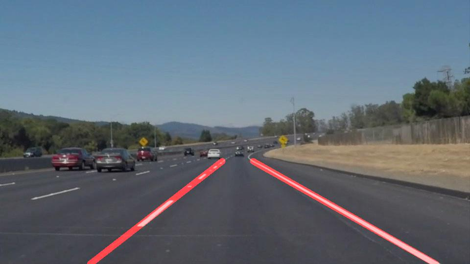

# **Finding Lane Lines on the Road** 

### Pipeline Description

Function `detect_lanes(img)` is used as pipeline to take input image and return image with lane line drawn on the same image. Steps performed to identify and draw lane lines are:-
  - Convert image to grayscale image.
  - Perform image smoothing on image by applying Gaussian filter on grayscale image from previous step.
  - Pass output image from previous step to Canny Edge detection filter to detect edges in image.
  - Apply polygon mask on image from previous step so that only ROI is used in further operations.
  - Apply probabilistic Hough transform to get the set of points in your ROI that might create an edge according to the parameters specified.
  - Extrapolate line segments calculated in previous step so that line is drawn on entire lane. To extrapolate line following steps are used:-
  	* Calculate slope for each line segment we get from hough transform.
  	* Classify them into two category left lane and right lane based on negative and positive slopes respectively.
  	* Compute slope and intersection/offset of line passing through collection of point for each lane by using `numpy polyfit` function.
  	* Once we get slope and intersect for each lane by using y starting and ending co-ordinates calculate corresponding x co-ordinates.
  	* Draw lines on blank image.
- Draw identified lane lines on original image by using image from previous step.
- Return the modified image.
- Following are some samples of pipeline results:-

| Original Image  | Results |
| ------------- | ------------- |
|   |   |
|   |   |
|   |   |
|   |   |
|   |   |
|   |   |
### Shortcommings
- May not work for curved lines.
- May not work if road has bumps, camera is misaligned, bad lightning conditions.

### Possible Improvements
- Make it work in bad and uneven lightning conditions.
- Reduce flickering of drawn lines.